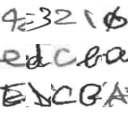
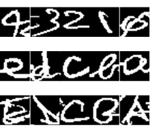

# Cursive-Handwriting-Dataset
A Cursive Handwriting Dataset with 62 classes cursive handwriting letters, "0-9, a-z, A-Z",\
each class at least have 40 pictures,the data is still updating


                            \
Original data examples                Binary data examples

Data mostly comes form Professor Tom's own handwritting and partly from CEDAR free handwriting pages.

in V0.2/dada is the 28 x 28 original handwriting letters\
in V0.2/data-bin is the 28 x 28 binary handwriting letters

Thanks to:\
* Prof. Tom Gedeon  tom@cs.anu.edu.au\
* CEDAR dataset: https://cedar.buffalo.edu/handwriting/HRdatabase.html 

## Title in Head-2

*<u>"description about the project"</u>*


## Sub-section 1 in Head-2 

*<u>"description about the sub-section1; if  additional files need to be downloaded, it should be included here"</u>*


#### File Sturcture

*<u>"use follwing template or '[tree](https://www.tecmint.com/linux-tree-command-examples/)' command in linux"</u>*

```reStructuredText
the project
 |
 +--+v0.2                    #include all data in the dataset, youcan see each .png data on the page
 |  |
 |  +---data                 #include all general rgb data
 |  |  |
 |  |  |
 |  |  +---data (1)          # class "0"
 |  |  …                     # the whole 62 classes of the data set, 0-9, a-z,A-Z
 |  |  |
 |  |  +---data (62)         # class "Z"
 |  +---data-bin             # include all binary data of their rgb origin
 |  |  |
 |  |  |
 |  |  +---data (1)
 |  |  …
 |  |  |
 |  |  +---data (62)
 |  +---label.txt            # labels from "data (1)" to "data (62)"
 +--v0.2.zip                 # the .zip file for the whole dataset
```


#### Package Requriment (Dependencies)

This software has only been tested on (*<u>"detailed hardware and software environment"</u>*)

Please install all the required package in your environment: 

> * Python >= xxx
>
> * ...
>


#### Run Programs 

1. **Prepare the Raw Data:**

xxxx

2. **Training commands:**

```bash
$ python xxx.py
usage: ....

optional arguments:
  -h, --help            show this help message and exit
  .....
```

3. **Quick Commands**

```bash
# run the xxx.py in default options 
$ python xxx.py 

# ...
$ python xxx.py -
```


#### Note

* 
* 


## Sub-section 2 in Head-2 


## Sub-section ... in Head-2 


------

### Cite the Paper

Use the following bibtex for citing the paper: 

```reStructuredText
@...

```
