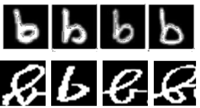

# A good CHoiCe: A Complex Handwritten Character dataset

Today’s free handwriting data sets on the market are too specific and the writing is too standard. It is difficult to train a universal handwriting recognition model based on these data. In the face of multiple styles and informal writing, deep learning models trained on data sets such as MNIST and EMNIST will not be effective. In the NIST series of data sets, you don’t have to face the lack of feature writing caused by even pen and cursive, nor will it appear in a bounding box with some other letters in the background of the strokes, let alone the same letter Huge style difference. However, these are practical problems that need to be faced in practical applications.Therefore, I hope to build a data set using letters in complex handwritten text as data, so that using this data set can more easily train a more universal handwritten text recognition model.

Here is a comparison between the lowercase letter "b" in the EMNIST data set and the lowercase letter "b" in this data set. It can be found that there is a huge difference between the lowercase letter "b" in the cursive state and the writing alone, which is based on ordinary handwriting The problem that the data set trained by the letter data set is difficult to solve.



The data of the dataset is collected from Professor Tom Gedeon and the complete handwriting paper of the CEDAR handwriting dataset.
A Cursive Handwriting Dataset with 62 classes cursive handwriting letters, "0-9, a-z, A-Z",\
each class in both the original data and the binary data at least have 40 pictures.
###### The data is still updating

Here are Original data examples     and           Binary data examples:\
                            

Data mostly comes form Professor Tom's own handwritting and partly from CEDAR free handwriting pages.

Dataset Builder:
Hongming Zhang: Hongming-Zhang@outlook.com

Thanks to:
* Prof. Tom Gedeon:  tom@cs.anu.edu.au
* CEDAR dataset: https://cedar.buffalo.edu/handwriting/HRdatabase.html 

### Data statistics
*<u>"The number of data in each category in the dataset is counted, and the number of "raw data" and "binarized data" are the same. The number of data in each category will not be less than 40."</u>*

 


### Dataset Sturcture

*<u>"The data format is a 28x28 ".png" format picture. The data set has a total of 62 categories of 0-9, a-z and A-Z, corresponding to the files "0" to "61" in the order of "label.txt". The data set is divided into two parts, the unprocessed original data image is stored in the "0" to "61" in the "V0.3/data" folder, and the binarized data image Stored in "0" to "61" in the "V0.3/data-bin" folder."</u>*


##### in V0.3/dada is the 28 x 28 original handwriting letters
##### in V0.3/data-bin is the 28 x 28 binary handwriting letters


*<u>"The file structure is looking as follows. Feel free to find what you want in the data set."</u>*

```reStructuredText
the project
 |
 +--+V0.3                    #include all data in the dataset, youcan see each .png data on the page
 |  |
 |  +---data                 #include all general rgb data
 |  |  |
 |  |  |
 |  |  +---0                 # class "0"
 |  |  |
 |  |  …                     # the whole 62 classes of the data set, 0-9, a-z,A-Z
 |  |  |
 |  |  +---61                # class "Z"
 |  +---data-bin             # include all binary data of their rgb origin
 |  |  |
 |  |  |
 |  |  +---0
 |  |  |
 |  |  …
 |  |  |
 |  |  +---61
 |  +---label.txt            # labels from "0/" to "61/"
 +--V0.3.zip                 # the .zip file for the whole dataset
```


------

### Cite this Dataset

Use the following bibtex for citing the dataset: 

```reStructuredText
@...

```
